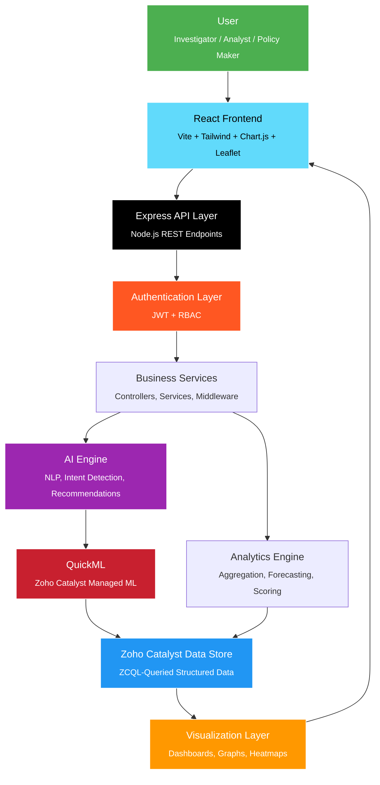
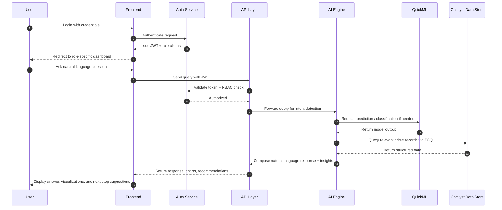

<div align="center">

#  KSP Crime Intelligence Platform

### An AI-Powered Conversational Crime Analytics & Investigation Platform for Karnataka State Police

[](LICENSE)
[](https://nodejs.org)
[](https://react.dev)
[](https://catalyst.zoho.com)
[](https://developer.mozilla.org/en-US/docs/Web/JavaScript)

[](#-contributing)
[](#)
[](#)

**Natural language access to crime data. Predictive intelligence for proactive policing.**

[Explore the docs »](#-table-of-contents) · [Report a Bug](#-contributing) · [Request a Feature](#-contributing)

</div>

---

##  Overview

The **KSP Crime Intelligence Platform** is an enterprise-grade, AI-driven conversational analytics system built to help investigators, crime analysts, and policymakers interact with Karnataka State Police crime databases using **natural language** — while surfacing predictive analytics, criminal intelligence, behavioral profiling, relationship analysis, hotspot detection, and policy-level insights, all from a single unified platform.

Instead of navigating rigid dashboards or writing complex queries, an investigator can simply ask:

> *"Show me repeat offenders in Bengaluru South involved in vehicle theft in the last 6 months."*

...and receive a structured, evidence-backed answer — complete with visualizations, relationship graphs, and recommended next steps.

> [!IMPORTANT]
> This platform is designed as a decision-support system for law enforcement and policy analysis. It augments investigator judgment with data-driven intelligence — it does not replace due process, legal procedure, or human oversight.

---

##  Table of Contents

<details open>
<summary><b>Click to expand</b></summary>

- [Overview](#-overview)
- [Problem Statement](#-problem-statement)
- [Objectives](#-objectives)
- [User Roles](#-user-roles)
- [Core Modules](#-core-modules)
- [Features](#-features)
- [Tech Stack](#-tech-stack)
- [System Architecture](#-system-architecture)
- [Directory Structure](#-directory-structure)
- [Installation](#-installation)
- [Environment Variables](#-environment-variables)
- [API Reference](#-api-reference)
- [Screenshots](#-screenshots)
- [End-to-End Workflow](#-end-to-end-workflow)
- [Security](#-security)
- [AI & ML Capabilities](#-ai--ml-capabilities)
- [Performance & Scalability](#-performance--scalability)
- [Roadmap](#-roadmap)
- [Contributing](#-contributing)
- [License](#-license)
- [Acknowledgements](#-acknowledgements)

</details>

---

##  Problem Statement

Crime data across districts is vast, fragmented, and difficult to interrogate quickly. Investigators lose valuable time manually cross-referencing FIRs, suspect records, and case histories across siloed systems. Analysts lack fast tooling to spot emerging patterns. Policymakers often make resourcing decisions without real-time, district-level evidence.

**KSP Crime Intelligence Platform** solves this by providing:

- A conversational interface over structured crime data (no SQL or query language required)
- AI-generated insights, summaries, and recommendations
- Predictive models for crime trend forecasting
- Automated relationship discovery across people, places, and assets
- Geo-spatial hotspot detection
- District-wise and state-wide analytics for strategic planning

---

##  Objectives

| # | Objective |
|:-:|:----------|
| 1 | Enable natural language querying over crime data |
| 2 | Generate AI-powered crime insights |
| 3 | Detect crime hotspots geospatially |
| 4 | Predict future crime trends |
| 5 | Discover hidden criminal relationships |
| 6 | Build interactive criminal network graphs |
| 7 | Perform behavioral profiling of repeat offenders |
| 8 | Provide district-wise comparative analytics |
| 9 | Generate investigative recommendations |
| 10 | Support tactical decision-making for investigators |
| 11 | Support pattern discovery for crime analysts |
| 12 | Assist policymakers through strategic dashboards |
| 13 | Reduce average investigation turnaround time |
| 14 | Improve proactive crime prevention through forecasting |

---

##  User Roles

The platform serves three distinct personas, each with a purpose-built experience governed by Role-Based Access Control (RBAC).

###  Crime Investigator

<table>
<tr><td width="50%">

**Responsibilities**
- Investigate active and cold cases
- Cross-reference suspects, victims, and witnesses
- Track case status and evidence chains
- Identify links between related cases

</td><td width="50%">

**Platform Capabilities**
- Conversational case lookup
- Criminal network graph exploration
- Behavioral profile access for known offenders
- AI-generated investigative recommendations
- Case-specific chat history and notes

</td></tr>
</table>

###  Crime Analyst

<table>
<tr><td width="50%">

**Responsibilities**
- Identify crime trends and emerging patterns
- Conduct district and category-level comparisons
- Support tactical resource deployment
- Validate model outputs against ground truth

</td><td width="50%">

**Platform Capabilities**
- Full analytics dashboard access
- Hotspot heatmaps and geospatial tools
- Time-series and forecasting views
- Exportable reports and data visualizations

</td></tr>
</table>

###  Policy Maker

<table>
<tr><td width="50%">

**Responsibilities**
- Evaluate district-level policing performance
- Guide resource allocation decisions
- Assess the impact of prior policy interventions
- Set strategic crime-prevention priorities

</td><td width="50%">

**Platform Capabilities**
- Strategic, high-level dashboards
- District performance comparisons
- Policy impact analysis views
- Long-term forecasting summaries

</td></tr>
</table>

---

##  Core Modules

### 1.  Conversational AI Assistant
Natural language querying over the crime database, including case lookup, district-level summaries, question answering, and recommendation generation — all through a chat-first interface.

### 2.  Crime Analytics Dashboard
Interactive dashboards covering crime trends, year-over-year analysis, district comparisons, category breakdowns, and full time-series analytics.

### 3.  Crime Prediction
Forecasts future crime rates per district and category, generates risk scores, powers an early-warning system, and reports prediction confidence alongside historical comparisons.

### 4.  Crime Hotspot Detection
Geospatial analysis rendered as interactive heatmaps, identifying high-risk zones and providing location-based intelligence for patrol and resource planning.

### 5.  Criminal Network Analysis
Builds relationship graphs connecting accused persons, victims, witnesses, bank accounts, mobile numbers, vehicles, properties, and organizations — surfacing non-obvious connections.

### 6.  Behavioral Profiling
Analyzes repeat-offender behavior patterns, generates risk scores, identifies modus operandi, and clusters offenders by behavioral similarity.

### 7.  Policy Analytics
District performance scoring, resource allocation insights, historical policy-impact analysis, and strategic recommendations for leadership.

---

##  Features

<details open>
<summary><b>Click to expand the full feature list (40+)</b></summary>

####  Conversational AI
- Natural language query understanding
- Multi-turn conversational context retention
- Intent detection and entity extraction
- Case-specific and district-specific Q&A
- Auto-generated crime summaries
- Context-aware follow-up suggestions
- Conversation history and session persistence

####  Analytics & Dashboards
- Real-time crime trend visualizations
- Yearly and monthly comparative analysis
- District-vs-district benchmarking
- Crime category breakdowns
- Customizable, filterable dashboard widgets
- Exportable reports (PDF/CSV)
- Role-specific dashboard views

####  Predictive Intelligence
- Time-series crime forecasting
- District-level risk scoring
- Early-warning alerts for emerging trends
- Model confidence intervals
- Historical vs. predicted trend comparison
- Category-specific forecasting models

####  Geospatial Intelligence
- Interactive crime heatmaps (Leaflet)
- Hotspot clustering algorithms
- Risk-zone classification
- Location-based drill-down
- Layered map filters by crime type and date range

####  Network & Relationship Intelligence
- Automated relationship graph generation
- Multi-entity linkage (people, assets, organizations)
- Interactive graph exploration UI
- Shortest-path relationship discovery
- Suspicious pattern flagging

####  Behavioral Intelligence
- Repeat-offender detection
- Modus operandi pattern matching
- Behavioral clustering
- Composite offender risk scoring
- Cross-case behavior correlation

####  Policy & Strategic Tools
- District performance scorecards
- Resource allocation recommendations
- Policy impact before/after analysis
- Strategic priority ranking
- State-wide executive summary views

####  Security & Access
- JWT-based authentication
- Role-Based Access Control (RBAC)
- Input validation and sanitization
- Encrypted data storage
- Full audit logging of user actions
- Session timeout and token refresh handling

####  Platform & Infrastructure
- Zoho Catalyst serverless functions
- Catalyst Cache for low-latency responses
- Catalyst Cron Jobs for scheduled model runs
- Catalyst Search for fast record retrieval
- Catalyst Monitoring & centralized logging
- Horizontally scalable AppSail deployment

</details>

---

##  Tech Stack

### Frontend

| Technology | Purpose |
|:-----------|:--------|
|  | Component-based UI framework |
|  | Build tooling & dev server |
|  | Utility-first styling |
|  | Data visualization |
|  | Interactive maps & hotspot rendering |

### Backend

| Technology | Purpose |
|:-----------|:--------|
|  | Runtime environment |
|  | REST API framework |
| JavaScript (ES Modules) | Modern module-based backend architecture |

### Database & Cloud

| Technology | Purpose |
|:-----------|:--------|
| Zoho Catalyst Data Store | Primary structured data store |
| Zoho Catalyst | Serverless cloud platform |

### Authentication

| Technology | Purpose |
|:-----------|:--------|
| JWT Authentication | Stateless session tokens |
| Role-Based Access Control (RBAC) | Fine-grained permission management |

### AI / ML

| Technology | Purpose |
|:-----------|:--------|
| QuickML (Zoho Catalyst) | Managed ML model training & inference |
| Scikit-Learn | Classification & regression models |
| Pandas / NumPy | Data preprocessing & numerical computation |
| NLP Engine | Intent detection & entity extraction |
| Time Series Forecasting | Crime trend prediction |
| Graph Intelligence | Relationship & network analysis |

### Catalyst Services Used

<div align="center">

| Service | Service | Service |
|:--|:--|:--|
| Catalyst Authentication | Catalyst Data Store | Catalyst Functions |
| Catalyst AppSail | Catalyst File Store | Catalyst Cache |
| Catalyst ZCQL | Catalyst Cron Jobs | Catalyst SmartBrowz |
| Catalyst Job Scheduling | Catalyst Notifications | Catalyst Search |
| Catalyst Monitoring | Catalyst Logs | — |

</div>

---

##  System Architecture



### Layer-by-Layer Breakdown

| Layer | Responsibility |
|:------|:----------------|
| **User** | Investigators, analysts, and policymakers interacting through role-specific UIs |
| **React Frontend** | Renders chat interface, dashboards, maps, and graphs; handles client-side state and routing |
| **Express API** | Exposes REST endpoints for chat, analytics, prediction, network, and policy modules |
| **Authentication** | Validates JWTs, enforces RBAC policies before any business logic executes |
| **Business Services** | Core application logic — controllers, services, and middleware coordinating requests |
| **AI Engine** | Performs NLP intent detection, entity extraction, and generates natural language responses and recommendations |
| **QuickML** | Hosts and serves trained ML models for prediction, classification, and behavioral analysis |
| **Analytics Engine** | Aggregates data, computes trends, risk scores, and hotspot clusters |
| **Zoho Catalyst Data Store** | System of record — all crime data, case records, and entity relationships, queried via ZCQL |
| **Visualization** | Chart.js dashboards, Leaflet heatmaps, and interactive relationship graphs rendered back to the user |

---

##  Directory Structure

```
ksp-crime-intelligence-platform/
├── frontend/
│   ├── public/
│   ├── src/
│   │   ├── assets/
│   │   ├── components/
│   │   │   ├── chat/
│   │   │   ├── dashboard/
│   │   │   ├── maps/
│   │   │   ├── graphs/
│   │   │   └── shared/
│   │   ├── pages/
│   │   │   ├── investigator/
│   │   │   ├── analyst/
│   │   │   └── policymaker/
│   │   ├── hooks/
│   │   ├── context/
│   │   ├── services/
│   │   ├── utils/
│   │   ├── App.jsx
│   │   └── main.jsx
│   ├── index.html
│   ├── tailwind.config.js
│   ├── vite.config.js
│   └── package.json
│
├── backend/
│   ├── functions/
│   │   ├── chat-function/
│   │   ├── analytics-function/
│   │   ├── prediction-function/
│   │   └── network-function/
│   ├── services/
│   │   ├── aiService.js
│   │   ├── analyticsService.js
│   │   ├── predictionService.js
│   │   ├── networkService.js
│   │   ├── behaviorService.js
│   │   └── policyService.js
│   ├── controllers/
│   │   ├── chatController.js
│   │   ├── analyticsController.js
│   │   ├── predictionController.js
│   │   ├── networkController.js
│   │   └── policyController.js
│   ├── middleware/
│   │   ├── authMiddleware.js
│   │   ├── rbacMiddleware.js
│   │   ├── validationMiddleware.js
│   │   └── errorHandler.js
│   ├── routes/
│   │   ├── authRoutes.js
│   │   ├── chatRoutes.js
│   │   ├── analyticsRoutes.js
│   │   ├── predictionRoutes.js
│   │   └── networkRoutes.js
│   ├── config/
│   │   ├── catalyst.config.js
│   │   └── env.config.js
│   ├── utils/
│   │   ├── logger.js
│   │   ├── zcqlHelper.js
│   │   └── responseFormatter.js
│   ├── models/
│   ├── server.js
│   └── package.json
│
├── ml-models/
│   ├── prediction/
│   ├── behavior-profiling/
│   ├── nlp-intent/
│   └── training-notebooks/
│
├── datasets/
│   ├── raw/
│   ├── processed/
│   └── sample/
│
├── docs/
│   ├── architecture.md
│   ├── api-reference.md
│   └── deployment-guide.md
│
├── screenshots/
├── .env.example
├── catalyst.json
├── LICENSE
└── README.md
```

---

##  Installation

### Prerequisites

| Requirement | Minimum Version |
|:-------------|:----------------|
| [Node.js](https://nodejs.org) | 18.x or later |
| npm | 9.x or later |
| [Zoho Catalyst CLI](https://catalyst.zoho.com/help/cli.html) | Latest |
| Git | Any recent version |
| Zoho Catalyst account | Active project with billing enabled for AppSail |

### Step-by-Step Setup

```bash
# 1. Clone the repository
git clone https://github.com/karnataka-police/ksp-crime-intelligence-platform.git
cd ksp-crime-intelligence-platform

# 2. Install Catalyst CLI (if not already installed)
npm install -g zcatalyst-cli

# 3. Login to Zoho Catalyst
catalyst login

# 4. Initialize the Catalyst project
catalyst init

# 5. Install backend dependencies
cd backend
npm install

# 6. Install frontend dependencies
cd ../frontend
npm install

# 7. Configure environment variables
cp .env.example .env
# Edit .env with your Catalyst project credentials

# 8. Start Catalyst local serving (backend functions)
catalyst serve

# 9. Start the frontend development server
npm run dev

# 10. Build for production
npm run build

# 11. Deploy to Zoho Catalyst
catalyst deploy
```

The application will be available locally at `http://localhost:5173` (frontend) with the Catalyst-served backend functions running alongside via `catalyst serve`.

---

##  Environment Variables

> [!TIP]
> Copy `.env.example` to `.env` in both `frontend/` and `backend/` before running the project, and never commit real secrets to version control.

| Variable | Description | Required |
|:---------|:-------------|:--------:|
| `JWT_SECRET` | Secret key used to sign and verify JWT tokens | ✅ |
| `JWT_EXPIRY` | Token expiration duration (e.g. `24h`) | ✅ |
| `CATALYST_PROJECT_ID` | Zoho Catalyst project identifier | ✅ |
| `CATALYST_CLIENT_ID` | OAuth client ID for Catalyst API access | ✅ |
| `CATALYST_CLIENT_SECRET` | OAuth client secret for Catalyst API access | ✅ |
| `CATALYST_ORG_ID` | Catalyst organization identifier | ✅ |
| `QUICKML_MODEL_ID` | Model ID for deployed QuickML prediction models | ✅ |
| `QUICKML_ENDPOINT` | QuickML inference endpoint URL | ✅ |
| `PORT` | Local server port for Express | ✅ |
| `NODE_ENV` | `development` / `staging` / `production` | ✅ |
| `RATE_LIMIT_WINDOW` | Rate-limiting window (ms) for API throttling | ⛔ |
| `RATE_LIMIT_MAX` | Max requests per window per client | ⛔ |
| `LOG_LEVEL` | Logging verbosity (`info`, `debug`, `error`) | ⛔ |

---

##  API Reference

All endpoints are prefixed with `/api/v1` and require a valid `Authorization: Bearer <token>` header unless otherwise noted.

<details>
<summary><b> Authentication</b></summary>

| Method | Endpoint | Description |
|:------:|:---------|:-------------|
| `POST` | `/auth/login` | Authenticate user and issue JWT |
| `POST` | `/auth/logout` | Invalidate current session |
| `POST` | `/auth/refresh` | Refresh an expiring JWT |
| `GET`  | `/auth/me` | Get current authenticated user profile |

</details>

<details>
<summary><b> Chat / Conversational AI</b></summary>

| Method | Endpoint | Description |
|:------:|:---------|:-------------|
| `POST` | `/chat/query` | Submit a natural language query |
| `GET`  | `/chat/history` | Retrieve conversation history |
| `DELETE` | `/chat/history/:sessionId` | Clear a specific chat session |

</details>

<details>
<summary><b> Analytics</b></summary>

| Method | Endpoint | Description |
|:------:|:---------|:-------------|
| `GET` | `/analytics/trends` | Fetch crime trend data |
| `GET` | `/analytics/district/:id` | District-level analytics |
| `GET` | `/analytics/category/:type` | Category-wise crime breakdown |
| `GET` | `/analytics/compare` | Compare multiple districts |

</details>

<details>
<summary><b> Prediction</b></summary>

| Method | Endpoint | Description |
|:------:|:---------|:-------------|
| `GET` | `/prediction/forecast` | Get forecasted crime rates |
| `GET` | `/prediction/risk-score/:districtId` | District risk score |
| `GET` | `/prediction/early-warning` | Active early-warning alerts |

</details>

<details>
<summary><b> Behavior</b></summary>

| Method | Endpoint | Description |
|:------:|:---------|:-------------|
| `GET` | `/behavior/profile/:offenderId` | Retrieve behavioral profile |
| `GET` | `/behavior/repeat-offenders` | List flagged repeat offenders |
| `GET` | `/behavior/clusters` | Behavioral clustering results |

</details>

<details>
<summary><b> Network</b></summary>

| Method | Endpoint | Description |
|:------:|:---------|:-------------|
| `GET` | `/network/graph/:caseId` | Get relationship graph for a case |
| `GET` | `/network/search` | Search entities across the network |
| `GET` | `/network/path` | Shortest-path relationship discovery |

</details>

<details>
<summary><b> Policy</b></summary>

| Method | Endpoint | Description |
|:------:|:---------|:-------------|
| `GET` | `/policy/performance` | District performance scorecards |
| `GET` | `/policy/allocation` | Resource allocation recommendations |
| `GET` | `/policy/impact` | Policy impact analysis |

</details>

<details>
<summary><b> Dashboard & Reports</b></summary>

| Method | Endpoint | Description |
|:------:|:---------|:-------------|
| `GET` | `/dashboard/summary` | Role-specific dashboard summary |
| `GET` | `/reports/export` | Export report (PDF/CSV) |

</details>

---

##  Screenshots

> [!NOTE]
> Screenshots below are placeholders. Replace the referenced paths in `/screenshots` with actual application captures before publishing.

<div align="center">

| Dashboard | Chatbot |
|:---------:|:-------:|
|  |  |

| Prediction | Analytics |
|:----------:|:---------:|
|  |  |

| Heatmap | Network Graph |
|:-------:|:-------------:|
|  |  |

</div>

---

##  End-to-End Workflow



1. **Login** — user authenticates and receives a JWT scoped to their role.
2. **Role Routing** — the frontend renders the Investigator, Analyst, or Policy Maker experience.
3. **Query Submission** — the user asks a question in natural language via the chat interface.
4. **Intent Detection** — the AI Engine parses the query and identifies the required data and analysis type.
5. **Model Inference** — QuickML is invoked when prediction, classification, or scoring is required.
6. **Data Retrieval** — relevant records are fetched from the Catalyst Data Store via ZCQL.
7. **Response Composition** — the AI Engine assembles a natural language answer alongside supporting charts, maps, or graphs.
8. **Recommendation** — where applicable, the system appends investigative or policy recommendations.
9. **Delivery** — the frontend renders the final response, visualizations, and any follow-up suggestions.

---

##  Security

| Control | Implementation |
|:--------|:----------------|
| **Authentication** | Stateless JWT tokens issued at login, verified on every protected request |
| **Authorization** | Role-Based Access Control (RBAC) enforced at the middleware layer for Investigator / Analyst / Policy Maker roles |
| **Input Validation** | All request payloads are schema-validated and sanitized before reaching business logic |
| **Secure APIs** | Rate limiting, CORS policies, and HTTPS-only communication across all endpoints |
| **Encrypted Storage** | Sensitive fields encrypted at rest within the Catalyst Data Store |
| **Audit Logs** | Every query, access request, and data mutation is logged via Catalyst Logs for full traceability |
| **Session Management** | Token expiry and refresh flows to minimize exposure from long-lived sessions |

---

##  AI & ML Capabilities

| Capability | Description |
|:-----------|:-------------|
| **Intent Detection** | Classifies user queries into supported operation types (lookup, trend, prediction, network, policy) |
| **Natural Language Understanding** | Extracts entities such as districts, crime categories, date ranges, and named individuals from free-text queries |
| **Forecasting** | Time-series models project future crime rates by district and category |
| **Classification** | Categorizes cases and offenders into risk tiers using supervised learning models |
| **Behavior Analysis** | Clusters offenders by modus operandi and historical behavior patterns |
| **Recommendation Engine** | Surfaces investigative next steps and policy suggestions based on retrieved evidence and model outputs |
| **Relationship Detection** | Graph-based analysis to uncover non-obvious links between people, assets, and organizations |

---

##  Performance & Scalability

- **Caching** — Catalyst Cache reduces repeated computation for frequently requested analytics and dashboard queries.
- **Optimized Queries** — ZCQL queries are indexed and scoped to minimize data-store load.
- **Serverless Functions** — Catalyst Functions scale independently per module (chat, analytics, prediction, network).
- **AppSail Deployment** — Horizontally scalable hosting for the Node.js/Express backend under variable load.
- **Scheduled Jobs** — Catalyst Cron Jobs handle periodic model retraining and data aggregation off the request path.
- **Cloud-Native Design** — Fully deployed on Zoho Catalyst, eliminating infrastructure management overhead while supporting elastic scaling.

---

##  Roadmap

###  Current Features
- Conversational AI query interface
- Crime analytics dashboard with trend and district comparisons
- Predictive forecasting with confidence scoring
- Hotspot heatmap visualization
- Criminal network relationship graphs
- Behavioral profiling and repeat-offender detection
- Policy analytics and district scorecards
- JWT authentication with RBAC
- Multi-language conversational support (Kannada, Hindi, English)
- Voice-based query input
- Mobile-responsive investigator field app
- Real-time case collaboration between investigators
- Automated case-linking suggestions across districts

###  Future Enhancements
- Integration with CCTNS and national crime databases
- Federated learning across district data silos
- Explainable AI (XAI) layer for model transparency
- Predictive patrol-route optimization
- Public-facing (anonymized) crime-trend transparency portal

---

##  Contributing

Contributions are welcome and appreciated. To contribute:

1. **Fork** the repository
2. **Create a feature branch**
   ```bash
   git checkout -b feature/your-feature-name
   ```
3. **Commit your changes** with clear, descriptive messages
   ```bash
   git commit -m "feat: add district-level forecast confidence intervals"
   ```
4. **Push to your fork**
   ```bash
   git push origin feature/your-feature-name
   ```
5. **Open a Pull Request** against the `main` branch with a clear description of the change and its motivation

### Guidelines

- Follow the existing code style and folder conventions.
- Write clear commit messages using [Conventional Commits](https://www.conventionalcommits.org/).
- Include tests for new services or business logic where applicable.
- Update relevant documentation (`docs/`) alongside code changes.
- Ensure no sensitive data, credentials, or real crime records are ever committed.

---

##  License

This project is licensed under the **MIT License** — see the [LICENSE](LICENSE) file for full details.

---

##  Acknowledgements

- **Karnataka State Police** — for the domain expertise, use-case definition, and operational guidance behind this platform
- **Zoho Catalyst** — for the serverless cloud infrastructure, QuickML, and managed backend services powering this system
- **React** — for the frontend component framework
- **Node.js** — for the backend runtime
- **The Open Source Community** — for the libraries and tools that make platforms like this possible

---

<div align="center">

**Built for safer communities through data-driven policing.**

<sub>KSP Crime Intelligence Platform — Actively maintained</sub>

</div>
